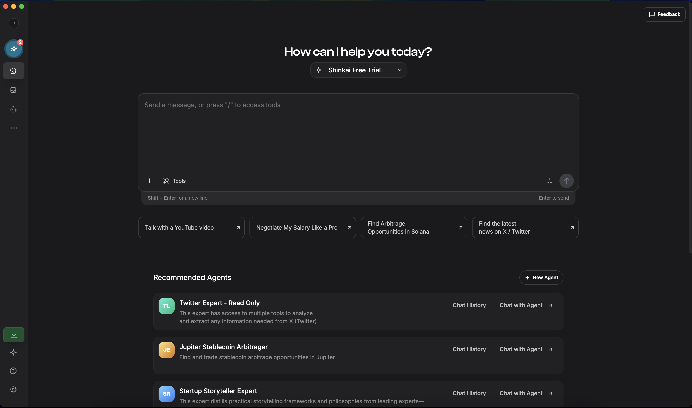

<h1 align="center">

  Shinkai
  </h1>
<div align="center">

> Create Powerful AI Agents using local or remote AIs

</div>

<p align="center">
  
  
  
</p>

<p align="center">
  <a href="https://github.com/dcSpark/shinkai-apps/stargazers"></a>
  <a href="https://discord.gg/EuA45U3sEu"></a>
  <a href="https://x.com/ShinkaiLocalAI"></a>
</p>

<p align="center">
  <strong>Build collaborative AI agents that work together, handle payments, and automate complex workflows</strong>
  <br/>
  Shinkai is a free, open-source platform that democratizes AI agent creation.
  No coding required – just drag, drop, and deploy intelligent agents that can work across platforms and handle real-world tasks.
</p>

<p align="center">
  <a href="#-features">Features</a> •
  <a href="#-demo">Demo</a> •
  <a href="#-examples">Examples</a> •
  <a href="#-quick-start">Quick Start</a> •
  <a href="#-development">Development</a> •
  <a href="https://docs.shinkai.com">Documentation</a>
</p>

---

## 🚀 Features

**🎯 No-Code Agent Builder** – Create specialized AI agents in minutes through an intuitive visual interface. No programming experience needed.

**🤖 Multi-Agent Orchestration** – Deploy teams of agents that collaborate, share context, and coordinate complex multi-step workflows automatically.

**💰 Crypto-Native Architecture** – Built-in support for decentralized payments, DeFi interactions, and autonomous economic agents that can transact independently.

**🔗 Universal Protocol Support** – Seamlessly integrates with Model Context Protocol (MCP), making your agents compatible with Claude, Cursor, and the broader AI ecosystem.

**⚡ Hybrid Deployment** – Run everything locally for maximum privacy, connect to cloud models for enhanced capabilities, or combine both approaches as needed.

**🔐 Security-First Design** – Your crypto keys, sensitive data, and computations remain under your control with local-first architecture.

**🌐 Cross-Platform Compatibility** – Works on Windows, macOS, and Linux with consistent performance and user experience.

## 🎬 Demo

[](https://github.com/user-attachments/assets/bc5bb7da-7ca5-477d-838a-8239951b6c01)

_Watch Shinkai agents collaborate to analyze market data, execute trades, and manage complex workflows autonomously._

## 📋 Examples

**💹 Autonomous Trading Bot** – Deploy an agent that monitors social sentiment, analyzes market trends, and executes trades based on predefined strategies.

**📧 Intelligent Email Assistant** – Create an agent that categorizes incoming emails, drafts contextual responses, and automatically schedules follow-ups.

**📊 Data Intelligence Agent** – Build agents that scrape web data, perform trend analysis, and generate comprehensive reports with actionable insights.

**🔄 Workflow Automation Hub** – Orchestrate multiple specialized agents that handle different components of complex business processes seamlessly.

**🏦 DeFi Portfolio Manager** – Set up agents that monitor your crypto investments, rebalance portfolios, and execute yield farming strategies.

## 🚀 Quick Start

### One-Click Installation

1. **Download** the latest release for your platform from our [releases page](https://github.com/dcSpark/shinkai-apps/releases)
2. **Install** and launch Shinkai
3. **Create** your first AI agent using our step-by-step guided interface

### System Requirements

- **Memory**: 4GB RAM minimum (8GB recommended)
- **Storage**: 2GB free space
- **OS**: Windows 10+, macOS 10.15+, or Linux (Ubuntu 20.04+)

---

## 🛠 Development

### Architecture Overview

Shinkai is built as a modern monorepo using **NX** for orchestration and dependency management. The architecture consists of:

**Core Applications:**

- **shinkai-desktop** – Cross-platform Tauri application with React frontend

**Shared Libraries:**

- **shinkai-message-ts** – Message protocols and network communication with Shinkai Node
- **shinkai-node-state** – React Query-based state management for node data
- **shinkai-ui** – Reusable React components with design system
- **shinkai-artifacts** – Styled UI primitives built on Radix and Tailwind CSS
- **shinkai-i18n** – Internationalization utilities powered by i18next

**Technology Stack:**

- **Frontend**: React 18, TypeScript, Tailwind CSS, Radix UI
- **Desktop**: Tauri (Rust + React)
- **State Management**: Zustand (UI state) + React Query (server state)
- **Build System**: Vite, NX monorepo
- **Testing**: Vitest, React Testing Library

### 🚀 Getting Started

#### 1. Clone and Setup

```bash
git clone https://github.com/dcSpark/shinkai-apps
cd shinkai-apps
nvm use
npm ci
```

#### 2. Download Required Side Binaries

Before running Shinkai, you'll need to download the embedded Shinkai Node binary that powers the application's core functionality. This can be done with a single command based on your platform:

**macOS (Apple Silicon):**

```bash
ARCH="aarch64-apple-darwin" \
SHINKAI_NODE_VERSION="v1.1.3" \
OLLAMA_VERSION="v0.9.3" \
npx ts-node ./ci-scripts/download-side-binaries.ts
```

**Linux:**

```bash
ARCH="x86_64-unknown-linux-gnu" \
OLLAMA_VERSION="v0.9.3" \
SHINKAI_NODE_VERSION="v1.1.3" \
npx ts-node ./ci-scripts/download-side-binaries.ts
```

**Windows:**

```powershell
$ENV:OLLAMA_VERSION="v0.9.3"
$ENV:SHINKAI_NODE_VERSION="v1.1.3"
$ENV:ARCH="x86_64-pc-windows-msvc"
npx ts-node ./ci-scripts/download-side-binaries.ts
```

### 📦 Essential Commands

#### Development Server

```bash
# Run desktop app (recommended for development)
npx nx serve:tauri shinkai-desktop
```

#### Building

```bash
# Build desktop application
npx nx build shinkai-desktop

# Create development build
NODE_OPTIONS="--max_old_space_size=8192" npx nx build shinkai-desktop --config="./src-tauri/tauri.conf.development.json"

# Build all projects
npx nx run-many --target=build
```

#### Third party data and repository management

```bash
# Update the built-in Ollama models repository. This repository contains model definitions, tags and metadata for all supported AI models. The command below regenerates the repository files to ensure compatibility with the latest Ollama version and model updates
npx ts-node ./ci-scripts/generate-ollama-models-repository.ts

# Generate Composio apps repository - This script regenerates the repository of pre-built Composio apps and templates that users can import into Shinkai. It ensures the app catalog stays up-to-date with the latest official releases.
deno run -A ./ci-scripts/composio-repository/main.ts

# Generate translations for all languages (EN, ES, etc.)
# This command uses AI to automatically generate translations for all supported languages based on the primary i18n source file (English).
# It ensures consistent translations across the entire application while maintaining natural language quality.

npx nx run shinkai-i18n:i18n
```

#### Testing & Quality

```bash
# Run tests
npx nx test [project-name]
npx nx run-many --target=test

# Lint code
npx nx lint [project-name]
npx nx run-many --target=lint
```

### 🏗 Project Structure

```
shinkai-apps/
├── apps/
│   └── shinkai-desktop/          # Main desktop application
├── libs/
│   ├── shinkai-message-ts/       # Core messaging protocol
│   ├── shinkai-node-state/       # State management
│   ├── shinkai-ui/               # Component library
│   ├── shinkai-artifacts/        # UI primitives
│   └── shinkai-i18n/             # Internationalization
├── ci-scripts/                   # Build and deployment scripts
└── tools/                        # Development utilities
```

### 🎨 UI Development Guidelines

**Component Libraries:**

- **Radix UI** – Unstyled, accessible component primitives
- **Tailwind CSS** – Utility-first styling and responsive design
- **Shadcn/ui** – Pre-built component patterns

**State Management:**

- **Zustand** – Client-side UI state management
- **React Query** – Server state, caching, and synchronization

### 🌍 Internationalization

<p align="start">
  
  
  
  
  
  
</p>

Shinkai supports multiple languages through our i18n system:

```bash
# Add new translation keys
# Edit files in libs/shinkai-i18n/locales/

# Generate updated translation types
npx nx run shinkai-i18n:i18n

# Supported languages: en-US, es-ES, zh-CN, ja-JP, id-ID, tr-TR
```

### 🤝 Contributing

1. **Fork** the repository
2. **Create** a feature branch: `git checkout -b feature/amazing-feature`
3. **Commit** your changes: `git commit -m 'Add amazing feature'`
4. **Push** to the branch: `git push origin feature/amazing-feature`
5. **Open** a Pull Request

### 📚 Additional Resources

- **[Official Documentation](https://docs.shinkai.com)** – Comprehensive guides and API reference
- **[Discord Community](https://discord.gg/EuA45U3sEu)** – Get help and connect with other developers
- **[Twitter Updates](https://x.com/ShinkaiLocalAI)** – Latest news and announcements

---

<p align="center">
  <strong>Built with ❤️ by the Shinkai community</strong>
  <br/>
  <a href="https://github.com/dcSpark/shinkai-apps/blob/main/LICENSE">Apache License</a> •
  <a href="https://github.com/dcSpark/shinkai-apps/issues">Report Bug</a> •
  <a href="https://github.com/dcSpark/shinkai-apps/issues">Request Feature</a>
</p>
