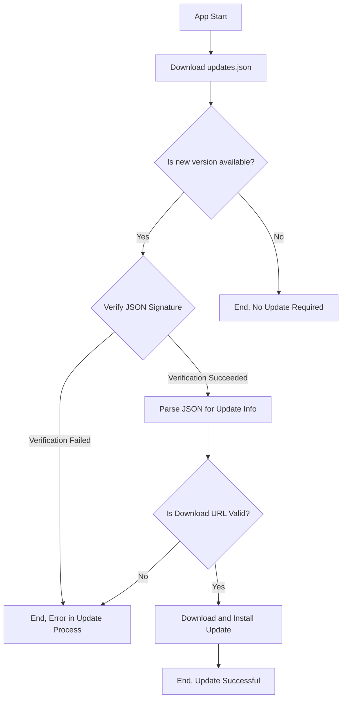

# Shinkai Desktop build/update system

## Build

Shinkai Desktop compiles for:

| Platform | Format    |
|----------|-----------|
| MacOS    | DMG       |
| Windows  | NSIS      |
| Linux    | AppImage  |

To build any of these artifact we execute:

`npx nx build shinkai-desktop`

This will generate at least 3 artifacts for the current platform:

| Artfiact | Purpose    |
|----------|-----------|
| {bundle_name}.{bundle-format}    | App Installer       |
| {bundle_name}.[tar.gz\|zip] | App Installer to deliver updates      |
| {bundle_name}.{compression-format}.sig    | Signature for updates  |

Artifact examples
- MacOS
  -`apps/shinkai-desktop/src-tauri/target/release/bundle/dmg/Shinkai Desktop_{version}_aarch64.dmg`
  - `apps/shinkai-desktop/src-tauri/target/release/bundle/macos/Shinkai Desktop.app.tar.gz`
  - `apps/shinkai-desktop/src-tauri/target/release/bundle/macos/Shinkai Desktop.app.tar.gz.sig`
- Windows
  - `apps/shinkai-desktop/src-tauri/target/release/bundle/nsis/Shinkai Desktop_{version}_x64-setup.exe`
  - `apps/shinkai-desktop/src-tauri/target/release/bundle/nsis/Shinkai Desktop_{version}_x64-setup.nsis.zip`
  - `apps/shinkai-desktop/src-tauri/target/release/bundle/nsis/Shinkai Desktop_{ersion}_x64-setup.nsis.zip.sig`
- Linux
  - `apps/shinkai-desktop/src-tauri/target/release/bundle/appimage/shinkai-desktop_{version}_amd64.AppImage`
  - `apps/shinkai-desktop/src-tauri/target/release/bundle/appimage/shinkai-desktop_{version}_amd64.AppImage.tar.gz`
  - `apps/shinkai-desktop/src-tauri/target/release/bundle/appimage/shinkai-desktop_{version}_amd64.AppImage.tar.gz.sig`

🔗 See for more information on:
[Windows Installer](https://tauri.app/v1/guides/building/windows) - 
[macOS Bundle](https://tauri.app/v1/guides/building/macos) - 
[Linux Bundle](https://tauri.app/v1/guides/building/linux)

## Sign & Notarize

As part of the building process, Tauri CLI executes a pipeline of postbuild processing over the generated artifacts (if we includes the right environment variables and configurations)

- App signing (Platform specific)
- App notarizing (Platform specific)
- Updates signing (Tauri specific)

The current implementation state of the post build processing is:

| Platform | App signing | App notarizing | Updates signing |
|----------|-------------|----------------|-----------------|
| MacOS    | ✅ | ❌ | ✅ |
| Windows  | ❌ | ❌ | ✅ |
| Linux    | ❌ | ❌ | ✅ |

### App signing and notarizing
#### Macos 

In case of MacOS, Tauri CLI sign the app automatically is we pass the following environment variables:

- **APPLE_SIGNING_IDENTITY**: Cert name con keychain
- **APPLE_CERTIFICATE**: Cert (.p12 file) as Base64
- **APPLE_CERTIFICATE_PASSWORD**: Cert password

ℹ️ In Macos we are using a self signed certificate to sign the app.

🔗 See for more information on [Code Signing macOS Applications](https://tauri.app/v1/guides/distribution/sign-macos)

#### Window

Not yet implemented.

🔗 See for more information on [Windows - Code signing guide locally](https://tauri.app/v1/guides/distribution/sign-windows)

#### Linux

Not yet implemented.

🔗 See for more information on [Code Signing Linux packages](https://tauri.app/v1/guides/distribution/sign-linux)

### Updates signing

For all platforms, Tauri CLI sign the app updates automatically is we pass the following environment variables:

- **TAURI_PRIVATE_KEY**: Sign private key
- **TAURI_KEY_PASSWORD**: Sign passphrase

This will enable the generation of the artfiacts described in the build section:
- {bundle_name}.[tar.gz\|zip]
- {bundle_name}.{compression-format}.sig

## Update

Once all build artfiacts are genearated and signed:

| Artfiact | Purpose    |
|----------|-----------|
| {bundle_name}.{bundle-format}    | App Installer       |
| {bundle_name}.[tar.gz\|zip] | App Installer to deliver updates      |
| {bundle_name}.{compression-format}.sig    | Signature for updates  |

### Upload artfiacts

They are uploaded to a R2 bucket in Cloudflare using the following structure:

`shinkai-desktop/binaries/[development|production]/{arch}/{version}/*`

IE: `shinkai-desktop/binaries/development/aarch64-apple-darwin/0.5.5/*`

🔗 R2 Bucket DNS: https://download.shinkai.com

### Distribute

At this point Shinkai Desktop is using the [default flow](https://tauri.app/v1/guides/distribution/updater#checking-for-updates) to deliver updates. It means when app start it fetches a JSON file from the R2 bucket `shinkai-desktop/binaries/development/updates.json` which allow the app determine if there is a new version to be installed for the current platform and where is the corresponding artifact.

#### updates.json example
```json
{
  "version": "0.5.2202",
  "notes": "Changed app title",
  "pub_date": "2024-03-25T17:30:00Z",
  "platforms": {
    "darwin-aarch64": {
      "signature": "dW50cnVzdGVkIGNvbW1lbnQ6IHNpZ25hdHVyZSBmcm9tIHRhdXJpIHNlY3JldCBrZXkKUlVTNG50TktKVkozbXdiZXdua1pvUFVMT0d2M2pwd2g0RlZvck9zTjNNSHZ6TjJsN2ZtaWpnVzAySzFWSXZxckx0TUF6bmRjUHhiMDhsVVo5MTExcnJLR2I2RXNmOXhWRFFvPQp0cnVzdGVkIGNvbW1lbnQ6IHRpbWVzdGFtcDoxNzExMzk4Nzc0CWZpbGU6U2hpbmthaSBUcmF5LmFwcC50YXIuZ3oKRVE5aC9xSUt3cHpmWEtFVENHS1FCUm42Z2ZYSE5lV1lGVUtYbHdHOEZnMXFJTHBNU1V0czlKaTlxUlNnd1B6SkNhRWdibGpRblRselFqSXdMM2dUQ1E9PQo=",
      "url": "https://download.shinkai.com/shinkai-desktop/binaries/development/aarch64-apple-darwin/0.5.2.202/Shinkai-Desktop-0.5.2.202_aarch64-apple-darwin.app.tar.gz"
    }
  }
}
```

Note that:
- **signature** is the content of the artifact `{bundle_name}.{compression-format}.sig``
- **url** points to the app updates artifact `{bundle_name}.[tar.gz\|zip]`

ℹ️ At this point updates.json is being generated manually after the CICD system builds and uploads the artifacts to R2.

To understand the update process better, take a look to the following high level diagram:



🔗 See for more information on [Updater](https://tauri.app/v1/guides/distribution/updater)

## Versioning

Technically, there 3 different places where a Tauri app could have the app versioning:

- `package.json`
- `tauri.conf.json`
- `src-tauri/cargo.toml`

As Shinkai Desktop is in a monorepository and to simplify the versioning process, it's configured to use the `package.version` attribute from the **root** `package.json` which means versions attributes from `tauri.conf.json`and `src-tauri/cargo.toml` doesn't need to be updated or changed to create new releases.

### Development

For development purposes we build and deliver the apps using the following version: `{package-version}.{ci-build-number}` this is very important because subsequents dev releases will have the same package-version but different build-number.

Also and very important, as package-version doesn't changes between dev releases, the file updates.json uploaded to R2 set the version as `{package-version}{ci-build-number}`.

🚨 With no dots, just major.minor.path, it's very important because we could add the build number as a pre-release or a build number according to the semver specification but at the moment it's not supported by Tauri and all the different app bundlers so any change we do to `updates.json` will break the updates system.

